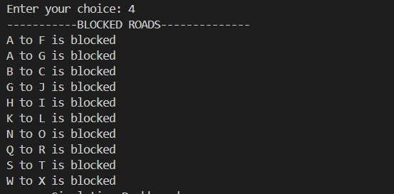

# Data Structures Final Project

                              Amna Zubair_ 23i-2556
                              Zara Tanveer_23i-2556
                               Ali Asjad_23i-2648

# The Smart Traffic Management System Simulator

The Smart Traffic Management System Simulator is a practical project designed to replicate
real-world traffic management in a city. It optimizes urban traffic flow using data structures like
graphs, heaps, and priority queues. The system focuses on real-time vehicle routing, traffic signal
control, congestion management, and emergency handling without incorporating predictive
features

## Table of Contents

- [Introduction](#introduction)
- [Features](#features)
- [Project Mechanics](#game-mechanics)
- [Installation](#installation)
- [Running the code](#running-the-game)
- [Code Explanation](#code_explaination)
- [Sample Outputs](#sample_outputs)
- [Dependencies](#dependencies)
- [Configuration](#configuration)
- [Troubleshooting](#troubleshooting)

## Introduction

In modern urban environments, efficient traffic flow is essential to minimize delays, enhance safety, and prioritize emergency response. This program is a comprehensive traffic simulation system designed to model real-world city traffic scenarios. It integrates advanced routing algorithms, dynamic traffic signals, congestion monitoring, and emergency vehicle prioritization to emulate and manage urban traffic.

The system enables:

- Dynamic routing for both emergency and regular vehicles.
- Real-time management of road conditions, including closures and congestion.
- Effective handling of traffic signal states to streamline vehicle movement.
- Priority-based dispatch and movement of vehicles to maintain order and reduce delays.

By incorporating algorithms like Dijkstra’s and A\*, the system ensures optimal routing while adapting to real-time conditions. This tool provides a robust foundation for understanding and managing complex urban traffic systems.

## Features

The provided code is designed to simulate and manage city traffic flow, incorporating both emergency and regular vehicles. The system models a city as a graph where nodes represent intersections, and edges represent roads with specific travel times. The simulation integrates various real-world traffic management features, including:

- Traffic Signals:

  - Signals at intersections with dynamic green and red light durations.
  - Signals influence regular vehicles but allow priority bypass for emergency vehicles.

- Vehicle Movement:

  - Regular vehicles follow shortest paths using Dijkstra’s algorithm and respect traffic signals.
  - Emergency vehicles prioritize speed and use A\* search algorithm to bypass congestion and signals.

- Congestion Management:

  - Roads are monitored for vehicle counts to detect congestion.
  - Congested paths trigger rerouting to reduce traffic density.

- Road Closures:

  - Roads can be blocked dynamically due to accidents or construction.
  - Vehicles reroute based on updated traffic data.

- Priority Queue:

  - Vehicles are processed based on their priority (emergency vehicles are prioritized).
  - A max-heap ensures the correct handling of vehicle dispatch.

- Simulation Dashboard:

  - Allows real-time traffic simulation with options to visualize:
    - City road network.
    - Current traffic signal status.
    - Congestion levels.
    - Blocked roads.

## Installation

1. Ensure you have `g++` installed on your system.

   For Ubuntu/Debian:

   ```bash
   sudo apt-get install g++
   ```

## Running the Code

2. Compile the code using the provided command:

   ```bash
   g++ -o q q.cpp
   ```

3. To run the game follow these commands:

   ```bash
   ./q
   ```

## Code Explanation

- Graph
  This class models the city road network as a graph:

  - Nodes: Represent intersections.
  - Edges: Represent roads with travel times.
  - Methods:
    - add_node(char node): Adds a new intersection to the graph.
    - add_edge(char node1, char node2, int travel_time): Connects two intersections with a road.
    - dijkstra(char start, char end): Finds the shortest path between two intersections.
    - astar(char start, char end, bool check_signal): Finds the optimal path considering congestion and traffic signals.
    - block_road(char node1, char node2): Marks a road as blocked.
    - display_blocked_roads(): Lists all currently blocked roads.

- Signal
  Manages a single traffic signal:

  - Attributes:
    - node: The intersection where the signal is located.
    - green_light_time / red_light_time: Duration of green and red lights.
    - is_green: Current state of the signal.
    - last_update: Tracks when the signal state was last updated.
  - Methods:
    - update_signal(): Toggles the signal state based on elapsed time.
    - get_signal_state(): Returns whether the signal is currently green.

- Signals
  Manages all traffic signals in the city:

  - Attributes:
    - signals[]: Array of Signal objects.
    - current_size: Current number of signals.
  - Methods:
    - add_signal(Signal temp): Adds a new signal.
    - load_data(): Loads signal data from a file.
    - update_signals(): Updates all signals in the city.
    - is_signal_open(char node): Checks whether the signal at a specific node is green.

- CongestionManager
  Monitors and manages congestion on roads:

  - Attributes:
  - vehicleCounts: Tracks the number of vehicles on each road.
  - congestedRoads: Marks roads as congested based on thresholds.
  - Methods:
  - monitorTraffic(Graph &g, char from, char to): Increments the vehicle count on a road and checks for congestion.
  - isPathCongested(Graph &g, char from, char to): Checks if a road is congested.
  - AlternativePathing(Graph g, char start, char end): Finds an alternate route for congested paths.
  - displayCongestionLevels(Graph &g): Prints congestion levels across the city.

- vehicle
  Represents a regular vehicle:

  - Attributes:
  - id: Vehicle identifier.
  - start, end: Source and destination intersections.
  - current: Current location.
  - priority: Vehicle priority ("low", "medium").
  - totaltime: Total travel time.
  - Methods:
  - move(Graph &g, CongestionManager &cm): Moves the vehicle to the next node along its route, handling congestion.
  - load_data(Graph &g, CongestionManager &cm): Loads vehicle data from a file and starts movement simulation.
  - display_vehicle_info(): Prints vehicle information.
    same features are of emergency_vehicle, but in this we are taking priority level from csv.

- priority_queue
  Manages vehicles in a max-heap based on priority:

  - Attributes:
  - heap[]: Array representing the priority queue.
  - size: Number of vehicles in the queue.
  - Methods:
  - insert_vehicle(vehicle &v): Adds a vehicle to the queue.
  - get_vehicle(): Removes the highest-priority vehicle.
  - is_empty(): Checks if the queue is empty.

- Hash, Entry, and hash_map
  Implements a hash map for efficient storage and lookup of road data:

  - Attributes:
    - table[]: Array of pointers to Entry objects.
  - Methods:
    - put(const string &road, int count): Inserts or updates the vehicle count for a road.
    - get(const string &road): Retrieves the vehicle count for a road.

- MinHeap
  Keeps track of roads with the least congestion:

  - Attributes:
    - heap[]: Array representing the heap.
    - size: Current size of the heap.
  - Methods:
    - insert(int start, int end, int vehicleCount): Adds a road to the heap.
    - extractMin(): Removes the road with the least congestion.

- Queue
  Implements a circular queue for BFS:

  - Attributes:
    - data[ ]: Array storing the queue.
    - front, rear, size: Indices and size of the queue.
  - Methods:
    - enqueue(char value): Adds an item to the queue.
    - dequeue(): Removes an item from the queue.

- VehicleManager
  Manages the lifecycle of all vehicles:

  - Attributes:
    - vehicles[]: Array of vehicle objects.
    - vehicleCount: Number of vehicles.
  - Methods:
    - load_data(Graph &g, CongestionManager &cm): Loads vehicle data and initializes them.
    - move_vehicles(Graph &g, CongestionManager &cm): Simulates movement for all vehicles.

## Sample Outputs

When you run the required commands, this will appear on your screen.


Enter the input.

- When user enter 1, the following display will appear
  it tells that how roads are connected.
  

- When user enter 2, the following display will appear
  it tells that what signals are closed and what are open.

- When user enter 3, the following display will appear
  it tells that how many cars are their on each road. plus tells the most populated road.
  

- When user enter 4, the following display will appear
  it tells that how many roads are block on the network
  

- When user enter 5,
  it tells that route of emergency vehicles,it uses A\* algo.
  rerouting of cars

- When user enter 6, the following display will appear
  it shows that we can block the road, if an accident occurs
  

- When user enter 7, the following display will appear
  it tells that how cars are moving on roads
  

- When user enter 8,
  it shows all possib;e paths between two nodes

- When user enter 8, the simulation will end.

## Dependencies

- g++: The code is written in C++ and requires a C++ compiler to build.
- Ubuntu: The code has been tested on Ubuntu.

## Troubleshooting

- If you encounter any issues during compilation or execution, ensure that you have the necessary dependencies installed and
- Invalid input: If you enter an invalid input, action will be taken.

##
